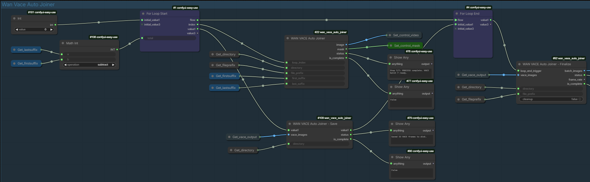

# WAN VACE Auto Joiner

**Seamlessly join multiple video clips using WAN VACE with one click.**


> Automatically process multiple video clips through WAN VACE to create smooth, consistent transitions between them.

---

## ✨ Features

- **One-click processing** — Queue once, process all videos automatically
- **Zero wasted computation** — VACE runs exactly N-1 times for N videos
- **Seamless transitions** — Maintains visual consistency between clips
- **Easy setup** — Works with ComfyUI Easy-Use For Loop

---

## 📸 Preview

<!-- Add your screenshots here -->


---

## 📦 Installation

### Via ComfyUI Manager (Recommended)

1. Open ComfyUI
2. Go to **Manager → Install Custom Nodes**
3. Search for `wan_vace_auto_joiner`
4. Click Install and restart ComfyUI

### Manual Installation

```bash
cd ComfyUI/custom_nodes
git clone https://github.com/Rhovanx/wan_vace_auto_joiner.git
```

Restart ComfyUI after installation.

---

## 📋 Requirements

- [ComfyUI](https://github.com/comfyanonymous/ComfyUI)
- [ComfyUI-Easy-Use](https://github.com/yolain/ComfyUI-Easy-Use) — For loop automation
- A working WAN VACE setup

---

## 🚀 Quick Start

### 1. Prepare Your Videos

Place your video clips in a folder with sequential numbering:

```
my_videos/
├── clip_00001.mp4
├── clip_00002.mp4
├── clip_00003.mp4
└── clip_00004.mp4
```

### 2. Set Up the Workflow

The nodes appear under **WAN VACE → Auto Joiner**

| Node | Purpose |
|------|---------|
| **WAN VACE Auto Joiner** | Prepares frames for VACE processing |
| **WAN VACE Auto Joiner - Save** | Saves VACE output between iterations |
| **WAN VACE Auto Joiner - Finalize** | Outputs the final joined video |

### 3. Configure the Loop

For **N videos**, set:
- **For Loop Start → total** = N - 1

| Videos | Loop Total |
|--------|------------|
| 2 | 1 |
| 3 | 2 |
| 4 | 3 |
| 5 | 4 |

### 4. Connect the Nodes

Follow this connection pattern:

```
┌─────────────────────────────────────────────────────────────────┐
│                                                                 │
│  For Loop Start                                                 │
│  ├── [flow] ──────────────────────────► For Loop End [flow]     │
│  ├── [value1] ──► Save ──[value1]────► For Loop End [initial_value1]
│  └── [index] ───► Auto Joiner                                   │
│                      │                                          │
│                      ▼                                          │
│                 WAN VACE Pipeline                               │
│                      │                                          │
│                  VAE Decode                                     │
│                      │                                          │
│                      └───► Save [vace_images]                   │
│                                                                 │
│  After Loop:                                                    │
│  For Loop End [value1] ───────────────► Finalize                │
│                                                                 │
└─────────────────────────────────────────────────────────────────┘
```

### 5. Run

Click **Queue** once — the workflow handles everything automatically!

---

## 🔧 Node Settings

### WAN VACE Auto Joiner

| Input | Description |
|-------|-------------|
| `loop_index` | Connect to For Loop Start's `index` output |
| `directory` | Folder containing your video clips |
| `file_prefix` | Filename prefix (e.g., `clip` for `clip_00001.mp4`) |
| `first_suffix` | First video number (usually `1`) |
| `last_suffix` | Last video number |

### WAN VACE Auto Joiner - Save

| Input | Description |
|-------|-------------|
| `value1` | Connect to For Loop Start's `value1` output |
| `directory` | Same folder as Auto Joiner |
| `vace_images` | Connect to VAE Decode output |

### WAN VACE Auto Joiner - Finalize

| Input | Description |
|-------|-------------|
| `loop_end_trigger` | Connect to For Loop End's `value1` output |
| `directory` | Same folder as Auto Joiner |
| `file_prefix` | Same prefix as Auto Joiner |
| `cleanup` | Delete temp files after completion |

---

## ⚠️ Video Requirements

| Requirement | Minimum |
|-------------|---------|
| First video | > 16 frames |
| All other videos | ≥ 17 frames |
| Resolution | Must match across all videos |

---

## ❓ Troubleshooting

### Loop only runs once
- Ensure `flow` goes **directly** from For Loop Start to For Loop End
- Ensure `value1` passes **through** the Save node

### Videos not detected
- Check filename format: `prefix_00001.mp4`
- Ensure numbering is sequential with no gaps

### "No temp folder found"
- Make sure `directory` is the same on all three nodes
- Auto Joiner must run before Save and Finalize

### "Video has only X frames, need at least 17"
- Each video (except the first) needs at least 17 frames
- The first video needs more than 16 frames

---

## 📄 License

MIT License — Free to use, modify, and distribute.

---

## 🙏 Credits

- [WAN VACE](https://github.com/Wan-Video/Wan2.1) — Video generation model
- [ComfyUI](https://github.com/comfyanonymous/ComfyUI) — Node-based interface
- [ComfyUI-Easy-Use](https://github.com/yolain/ComfyUI-Easy-Use) — Loop functionality

---

## 💬 Support

If you encounter issues or have suggestions:
- [Open an Issue](https://github.com/Rhovanx/wan_vace_auto_joiner/issues)
